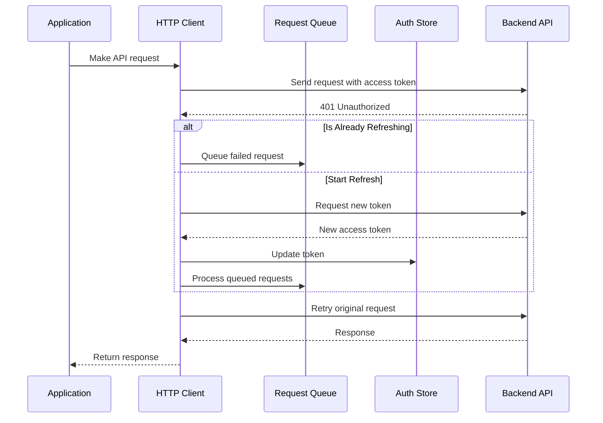

# Secure Auth Client

A React-based frontend application implementing secure authentication with JWT token rotation, built with TypeScript and Vite.

## Project Structure
```
client/
├── src/
│   ├── clients/
│   │   └── http/              # HTTP client implementation
│   ├── components/            # Reusable components
│   ├── configs/
│   │   ├── env/              # Environment configurations
│   │   └── routes/           # Route configurations
│   ├── hooks/                # Custom React hooks
│   ├── repositories/         # API repositories
│   ├── stores/              # Global state stores
│   └── views/               # Page components and view models
```

## Core Features

### HTTP Client Implementation
The application uses a custom HTTP client with advanced features:

- **Base Client (`BasicHttpClient`)**: 
  - Implements standard HTTP methods (GET, POST, PUT, DELETE)
  - Handles request/response transformations
  - Configurable base URL and headers

- **Auth Client (`HttpClient`)**:
  - Automatic token injection
  - Token refresh mechanism
  - Request queue during token refresh
  - Error handling with status codes
  - Automatic logout on auth failures

#### Token Refresh Mechanism
The HTTP client implements a sophisticated token refresh system that handles concurrent requests and token rotation:

1. **Request Interception**:
   - Every request automatically includes the access token
   - 401 responses trigger the refresh flow
   - Non-auth endpoints are intercepted for token refresh

2. **Refresh Flow**:


3. **Key Features**:
   - Request queueing during refresh
   - 10-second refresh timeout
   - Automatic retry of failed requests
   - Race condition prevention
   - Token storage synchronization

4. **Error Handling**:
   - Refresh token expiration handling
   - Automatic logout on refresh failure
   - Request queue rejection on errors
   - Custom error transformations

5. **Implementation Details**:

```typescript
// Handling unauthorized errors
private async handleUnauthorizedError<T>(url: string, config: RequestInit): Promise<T> {
    if (this.isRefreshing) {
        return new Promise<T>((resolve, reject) => {
            this.failedQueue.push({ resolve, reject, url, config });
        });
    }

    this.isRefreshing = true;
    try {
        await this.handleTokenRefresh();
        await this.processQueue();
        return super.makeRequest<T>(url, config);
    } catch (error) {
        await this.handleLogout();
        throw error;
    } finally {
        this.isRefreshing = false;
    }
}
```

This implementation ensures:
- Only one refresh request at a time
- Failed requests are queued and retried
- Automatic logout on refresh token expiration
- Clean state management during refresh


### Authentication Flow

1. **Token Management**:
   - Access token stored in memory
   - Refresh token in HTTP-only cookies
   - Automatic token refresh before expiration
   - Token rotation on refresh

2. **Global Auth State**:
   - Centralized auth store
   - Token persistence
   - User session management
   - Automatic state cleanup on logout

I'll expand the Routing System section with detailed explanations about the authentication and redirection mechanisms:

### Routing System

#### Route Configuration
- Lazy-loaded components for optimized loading
- Protected route guards with authentication checks
- Authentication state synchronization
- Loading states during auth checks

#### Route Structure
- `/login`: Authentication page
- `/`: Main application layout
- `/profile`: Protected user profile

### Authentication & Redirection System

1. **Root Layout Authentication (`RootRouteLayout`)**:
   - Wraps all routes with authentication check
   - Handles initial token refresh
   - Shows loading state during authentication
   ```mermaid
   sequenceDiagram
       participant User
       participant Root as RootLayout
       participant Auth as AuthHook
       participant API
       
       User->>Root: Access any route
       Root->>Auth: Check authentication
       alt No Access Token
           Auth->>API: Attempt token refresh
           API-->>Auth: New token / Error
           Auth-->>Root: Update auth state
       end
       Root-->>User: Render route / Redirect
   ```

2. **Protected Route Guards**:
   - **Unauthenticated Redirection**:
     - Monitors authentication state
     - Redirects to login if no access token
     - Preserves original destination in state
     - Handles forced logout scenarios

```typescript
// Protected route redirection
function useUnauthenticatedRedirection() {
    const { accessToken } = useSnapshot(authStore.state);
    
    useEffect(() => {
        if (!accessToken) {
            navigate(loginRoute.path, {
                replace: true,
                state: { from: location }, // Preserve intended destination
            });
        }
    }, [accessToken]);
}
```
   
   - **Authenticated Redirection**:
     - Prevents authenticated users from accessing public routes
     - Redirects to main application
     - Restores previous route if available

```typescript
// Public route redirection
function useAuthenticatedRedirection() {
    const { accessToken } = useSnapshot(authStore.state);
    
    useEffect(() => {
        if (accessToken) {
            const destination = location.state?.from?.pathname || mainRoute.path;
            navigate(destination, { replace: true });
        }
    }, [accessToken]);
}
```

### Data Layer

1. **Repositories**:
   - `AuthRepository`: Authentication operations
   - `UserRepository`: User data operations
   - Type-safe request/response handling

2. **API Integration**:
   - React Query for data fetching
   - Automatic cache management
   - Error boundary handling
   - Loading states

### View Architecture

1. **View Models**:
   - Separation of UI and business logic
   - Form handling with validation
   - Navigation management
   - Error state handling

2. **Components**:
   - Form components with validation
   - Loading indicators
   - Error displays
   - Protected route wrappers

## Development Setup

1. **Prerequisites**:
   - Node.js (v14+)
   - npm or yarn
   - TypeScript knowledge

2. **Installation**:
```bash
npm install
```

3. **Environment Setup**:
   Copy `.env.example` to `.env`:
```plaintext
VITE_API_URL=http://localhost:5000/api
```

4. **Development Server**:
```bash
npm run dev
```

## Security Features

- Access tokens stored only in memory
- HTTP-only cookies for refresh tokens
- Automatic token rotation
- Protected route guards
- Input validation
- Error handling for auth failures
- Secure cookie configurations

## Available Scripts

- `npm run dev`: Start development server
- `npm run build`: Build for production
- `npm run lint`: Run ESLint
- `npm run preview`: Preview production build
```