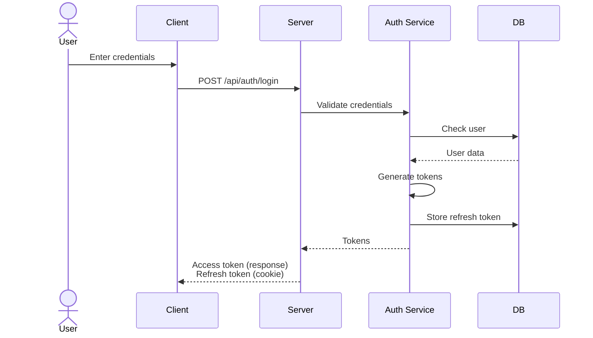
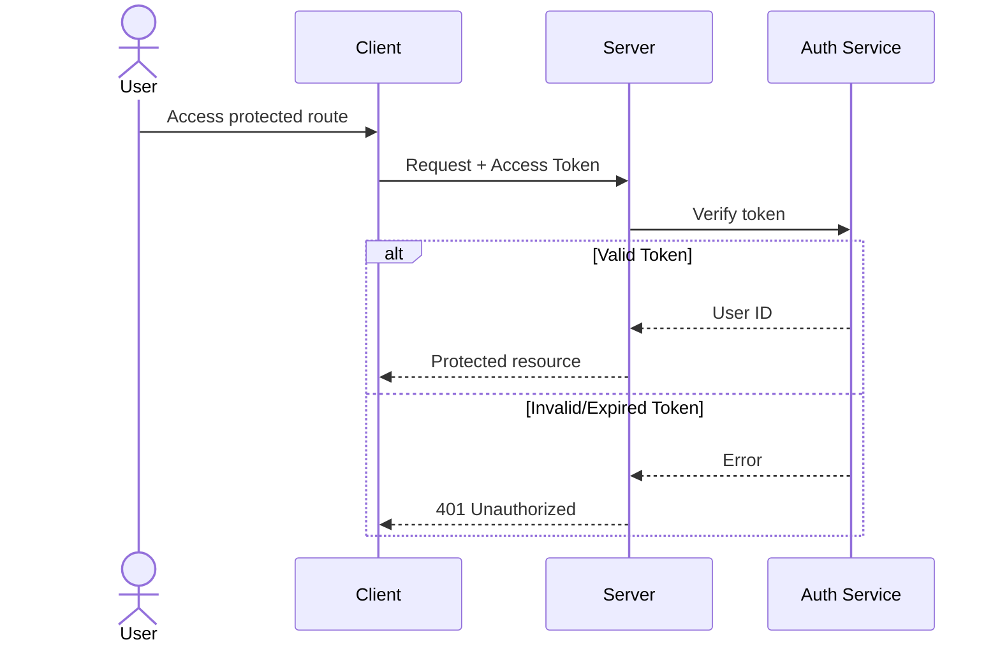
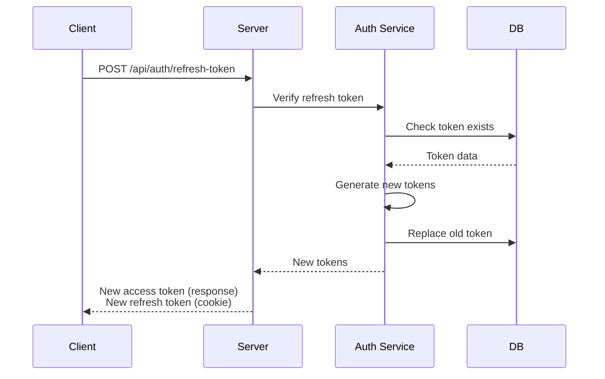
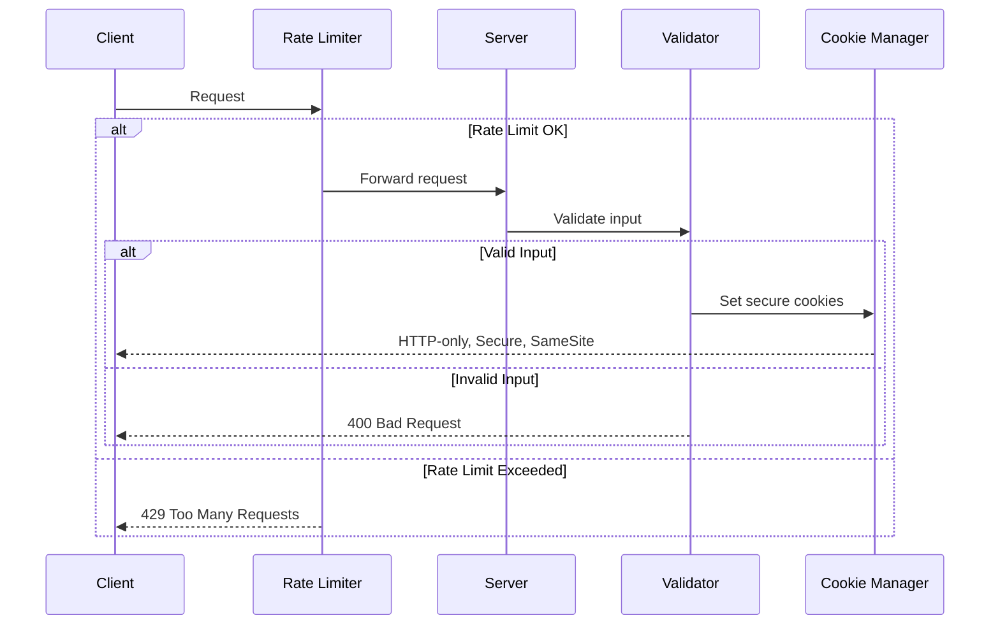

# Secure Authentication Server

A secure authentication server built with Express.js and TypeScript that implements JWT-based authentication with refresh token rotation. The server provides robust security features including rate limiting, secure cookie handling, and input validation.


## 1. Getting Started
### Prerequisites
- `Node.js` (v14 or higher)
- `TypeScript`
- `npm` or `yarn`

### Installation
1. Clone the repository
```bash
git clone https://github.com/ifindev/secure-authentication
cd secure-auth/server
```

2. Install dependencies
```bash
npm install
```

### Environment Setup
1. Create a `.env` file in the server root directory
2. Add the following environment variables:
```plaintext
PORT=5000
NODE_ENV=development
ACCESS_TOKEN_SECRET=your_access_token_secret
REFRESH_TOKEN_SECRET=your_refresh_token_secret
```

Key configurations:
- Access token expires in 15 minutes
- Refresh token expires in 4 hours
- Server runs on port 5000 by default
- CORS is configured to allow requests from `http://localhost:5173`
- Rate limiting is enabled:
  - General API: 100 requests per 15 minutes
  - Login endpoint: 5 attempts per 15 minutes
  - Refresh token endpoint: 10 requests per 15 minutes

The server exposes two main API routes:
- `/api/auth`: Authentication endpoints (login, logout, refresh token)
- `/api/users`: User-related endpoints (get profile)

## 2. Architecture

### Project Structure
```
server/
├── src/
│   ├── app/
│   │   ├── app.ts              # Express application setup
│   ├── controllers/
│   │   ├── auth.controller.ts  # Authentication handlers
│   │   └── user.controller.ts  # User-related handlers
│   ├── middleware/
│   │   ├── auth.middleware.ts  # JWT verification
│   │   └── rate-limiter.ts     # API rate limiting
│   ├── models/
│   │   ├── auth.model.ts       # Authentication DTOs
│   │   └── user.model.ts       # User-related DTOs
│   ├── repositories/
│   │   ├── auth.repository.ts  # Token storage operations
│   │   └── user.repository.ts  # User data operations
│   ├── services/
│   │   ├── auth.service.ts     # Authentication business logic
│   │   └── user.service.ts     # User-related business logic
│   └── utils/
│       ├── jwt.ts              # JWT operations
│       └── validate.ts         # Input validation
```

### Core Components
- **App**: Central Express application setup with middleware configuration and route registration
- **Controllers**: Handle HTTP requests and responses
- **Services**: Implement business logic and orchestrate data operations
- **Repositories**: Handle data storage and retrieval operations
- **Middleware**: Implement cross-cutting concerns like authentication and rate limiting
- **Models**: Define data transfer objects and validation schemas
- **Utils**: Provide shared utilities for JWT operations and input validation


## 3. Authentication System

### Authentication Flow

The authentication flow describes the complete process of how users authenticate with the system, from initial login to accessing protected resources. It covers the entire lifecycle of authentication tokens, including generation, validation, and renewal through refresh token rotation. This flow ensures secure user sessions while maintaining a seamless user experience.

<details>
<summary>View detailed explanation</summary>

- Login process with input validation
- Token generation and storage
- Cookie handling with security configurations
- Protected route access control
- Error handling for invalid credentials
</details>



### Token Management

Token management is a critical component of the authentication system that handles the lifecycle of both access and refresh tokens. It encompasses the generation, validation, storage, and rotation of tokens to maintain secure user sessions. The system uses JWTs (JSON Web Tokens) with different expiration times and storage strategies to balance security and user experience.

<details>
<summary>View detailed explanation</summary>

- Access token: 15-minute JWT with user ID payload
- Refresh token: 4-hour JWT stored in database
- Token verification and validation process
- HTTP-only cookie management
- Authorization header handling
</details>



### Refresh Token Rotation

Refresh token rotation is a security mechanism that enhances the authentication system by replacing used refresh tokens with new ones after each use. When a client uses a refresh token to obtain a new access token, the system automatically invalidates the old refresh token and issues a new one. This approach provides several security benefits:

1. Limits the impact of stolen refresh tokens since they become invalid after first use
2. Creates an audit trail of token usage
3. Allows the system to detect potential token theft by tracking concurrent usage
4. Reduces the window of opportunity for attackers to exploit compromised tokens


<details>
<summary>View detailed explanation</summary>

- Single-use refresh tokens
- Token replacement in database
- Automatic invalidation
- New token pair generation
- Security measures against token theft
</details>



### Security Features
The authentication server implements multiple layers of security measures to protect against common web vulnerabilities and attacks. These features work together to ensure secure user authentication, prevent unauthorized access, and maintain data integrity.

<details>
<summary>View detailed explanation</summary>

- Rate limiting per endpoint
- Input validation using Zod
- Secure cookie configurations
- CORS protection
- Error handling strategies
</details>



## 4. API Documentation

### POST `/api/auth/login`
**Request:**
```json
{
  "username": "string",
  "password": "string"
}
```
**Response:** `200 OK`
```json
{
  "accessToken": "string"
}
```
*Note: Refresh token is set as HTTP-only cookie*

### POST `/api/auth/refresh-token`
**Request:** No body (requires refresh token cookie)

**Response:** `200 OK`
```json
{
  "accessToken": "string"
}
```
*Note: New refresh token is set as HTTP-only cookie*

### POST `/api/auth/logout`
**Request:** No body required

**Response:** `200 OK`
```json
{
  "message": "Logged out successfully"
}
```
*Note: Clears refresh token cookie*

### GET `/api/users/profile`
**Request:** No body (requires Bearer token)

**Response:** `200 OK`
```json
{
  "id": "string",
  "username": "string",
  "email": "string"
}
```

## Error Responses

All endpoints may return these errors:
```json
{
  "error": "string",
  "details": ["string"],
  "retryAfter": "number" // only for rate limit errors
}
```
### HTTP Status Codes
- `200`: OK
- `400`: Bad Request
- `401`: Unauthorized
- `403`: Forbidden
- `429`: Too Many Requests
- `500`: Server Error


## 5. Security

### Rate Limiting
Protects against brute force attacks and DoS attempts by limiting request frequency. Different limits are applied based on endpoint sensitivity:
- Login attempts are strictly limited to prevent credential stuffing
- Refresh token requests are moderately limited to prevent token farming
- General API has higher limits for normal operation

```typescript
// Implementation using express-rate-limit
{
  login: { max: 5, windowMs: 15 * 60 * 1000 },    // 5 attempts/15min
  refresh: { max: 10, windowMs: 15 * 60 * 1000 }, // 10 requests/15min
  general: { max: 100, windowMs: 15 * 60 * 1000 } // 100 requests/15min
}
```

### CORS Configuration
Cross-Origin Resource Sharing (CORS) settings to control which domains can access the API. Configured to allow only the frontend application while enabling secure cookie handling:

```typescript
// Configured in app.ts
{
  origin: 'http://localhost:5173',
  credentials: true,
  methods: ['GET', 'POST', 'PUT', 'DELETE'],
  allowedHeaders: ['Content-Type', 'Authorization']
}
```

### Input Validation
Strict validation using Zod ensures all incoming data meets security requirements. Validates:
- User credentials format and length
- Token formats and signatures
- Request body schemas
- Query parameters

```typescript
// Using Zod schemas
const loginSchema = z.object({
  username: z.string().min(3).max(50),
  password: z.string().min(8).max(100)
});

const userSchema = z.object({
  email: z.string().email(),
  username: z.string().min(3)
});
```

### Cookie Security
HTTP-only cookies for refresh tokens with strict security settings to prevent XSS and CSRF attacks. Configuration ensures:
- JavaScript cannot access cookies
- Cookies only sent over HTTPS
- Strict same-site policy prevents CSRF
- Limited cookie lifetime

```typescript
// Secure cookie configuration
{
  httpOnly: true,      // Prevents JavaScript access
  secure: true,        // HTTPS only
  sameSite: 'strict', // Prevents CSRF
  maxAge: 4 * 60 * 60 * 1000, // 4 hours
  path: '/api'
}
```